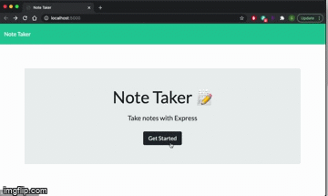

  ## Note Taker Using Express

  ## Table of Contents
    - #Description
    - [Installation](#installation)
    - [Usage](#usage)
    - [Tests](#tests)
    - [License](#license)
    - [Technolgies Used](#tech)
    - [Contribution](#contribution)
    - [Github](#github)
    - [Email](#email)
    
  ## Description
      User will be able to type and save their notes
  ## Installation:
    npm install
  ## Usage:
    Type note title and text then click save
  ## Tests

  

  ## Contributors
    Geoffrey Jiang 
    Victor Tran  
  ## License
    MIT License  
  ## Programs
    Node
    Express
    VS
  ## Github
    https://github.com/geoffreyjiang/note_taker
  ## Email
    geoffreychjiang@gmail.com
